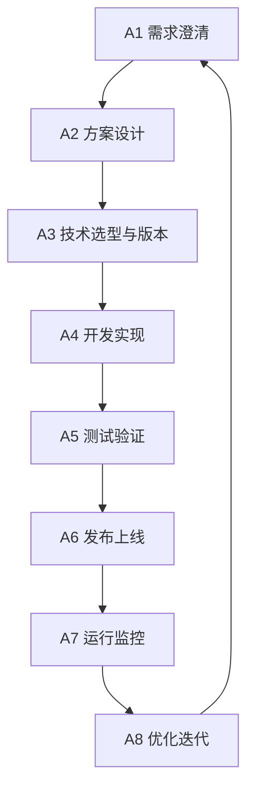

# 工程架构流程总览

```mermaid
flowchart TD
    N1["A1 需求澄清"] --> N2["A2 方案设计"]
    N2 --> N3["A3 技术选型与版本"]
    N3 --> N4["A4 开发实现"]
    N4 --> N5["A5 测试验证"]
    N5 --> N6["A6 发布上线"]
    N6 --> N7["A7 运行监控"]
    N7 --> N8["A8 优化迭代"]
    N8 --> N1

    click N1 "A1-需求澄清.md" "打开 A1"
    click N2 "A2-方案设计.md" "打开 A2"
    click N3 "A3-技术选型与版本.md" "打开 A3"
    click N4 "A4-开发实现.md" "打开 A4"
    click N5 "A5-测试验证.md" "打开 A5"
    click N6 "A6-发布上线.md" "打开 A6"
    click N7 "A7-运行监控.md" "打开 A7"
    click N8 "A8-优化迭代.md" "打开 A8"
```

如果你的 Obsidian 主题/设置不支持 Mermaid 点击，可用下面的备用跳转：

- [[A1-需求澄清]]
- [[A2-方案设计]]
- [[A3-技术选型与版本]]
- [[A4-开发实现]]
- [[A5-测试验证]]
- [[A6-发布上线]]
- [[A7-运行监控]]
- [[A8-优化迭代]]
