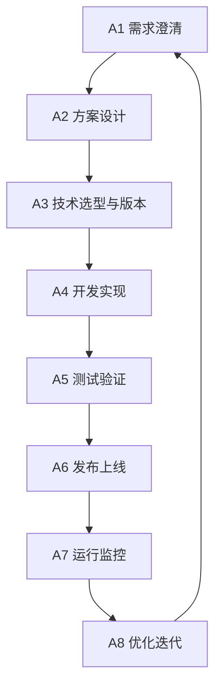

## 流程地图

这是一张工程架构工作的总览图，用来把项目从需求澄清到长期迭代的关键阶段串起来。

## 备用跳转

如果 Mermaid 点击不可用，可以使用下面的站内锚点：

- [A1 需求澄清](#a1-需求澄清)
- [A2 方案设计](#a2-方案设计)
- [A3 技术选型与版本](#a3-技术选型与版本)
- [A4 开发实现](#a4-开发实现)
- [A5 测试验证](#a5-测试验证)
- [A6 发布上线](#a6-发布上线)
- [A7 运行监控](#a7-运行监控)
- [A8 优化迭代](#a8-优化迭代)

## A1 需求澄清

先确认问题、边界、用户、约束和验收标准。这个阶段的目标不是马上给方案，而是把“要解决什么”讲清楚。

## A2 方案设计

把需求拆成可实现的模块、数据流、接口和关键路径。方案设计需要明确哪些地方稳定，哪些地方允许后续迭代。

## A3 技术选型与版本

选择技术栈、框架、依赖版本和部署方式。这里重点记录选择理由、替代方案和风险，而不是只记录最终结论。

## A4 开发实现

进入编码、联调和功能落地阶段。实现过程要持续回看前面的约束，避免代码实现偏离原始目标。

## A5 测试验证

验证功能、异常路径、边界条件和部署前风险。对于个人项目，至少要保证核心路径可重复验证。

## A6 发布上线

把项目交付到真实环境。发布阶段需要关注构建、环境变量、域名、缓存、回滚和基础监控。

## A7 运行监控

上线后观察错误、性能、可用性和用户行为。监控不是大项目专属，个人项目也需要最小可观测性。

## A8 优化迭代

基于真实反馈继续调整。迭代后的新问题会重新进入需求澄清，形成持续循环。
