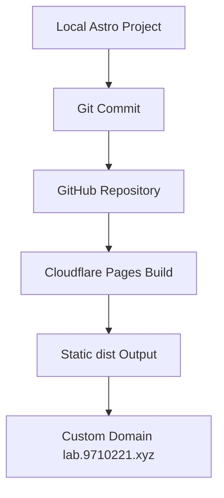

## One-line Summary

A static personal site for project reviews, engineering notes, technical retrospectives, and small interactive demos.

## Background

The goal was to build a maintainable site without self-hosting a server. The site needed to support MDX content, Mermaid diagrams, images, frontend interactions, GitHub-based updates, and deployment to a custom domain.

## Goals

- Ship a lightweight but presentable first version.
- Keep the content model ready for deeper project reviews and engineering notes.
- Avoid backend services, login, comments, and databases in the first version.
- Use GitHub and Cloudflare Pages for automatic deployment.

## Technical Approach

Astro generates the static pages, MDX stores project reviews and notes, and plain CSS handles the visual system and Lab interactions.



## CI/CD Flow

```text
Edit locally
→ npm run build
→ git add / commit
→ git push to GitHub main
→ Cloudflare Pages runs npm run build
→ publish dist
→ custom domain updates
```

## Tradeoffs

The first version intentionally keeps the system static. This lowers maintenance cost and keeps the focus on content structure, project retrospectives, and publishing workflow.

## Result

The site now includes home, projects, posts, Lab, About, custom domain deployment, Obsidian note migration samples, and an interactive HTTP flow demo.

## Next Steps

- Expand bilingual content.
- Add tag index pages.
- Improve project metadata and links.
- Add static search.
- Continue migrating useful Obsidian notes into publishable MDX.
