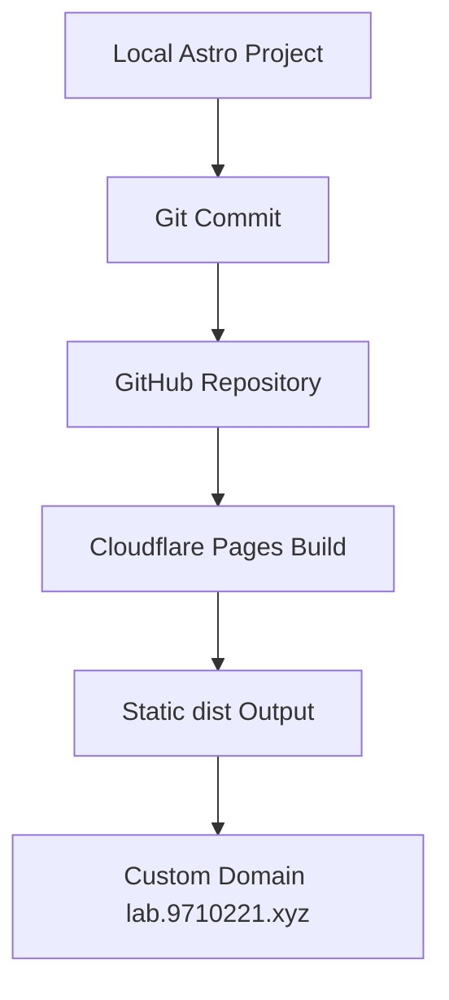

## 一句话介绍

一个用于展示个人项目、工程笔记、技术复盘和实验 demo 的静态个人站。

## 背景

我需要一个不自管服务器、能绑定自有域名、支持 Markdown/MDX、Mermaid 图、图片和前端动态效果的个人站。

这个站不是普通浅博客，而是作为“个人项目实验室 + 技术复盘档案”的第一版展示面。后续可以继续扩展成更完整的沉淀系统。

## 目标

- 第一版先轻量可展示。
- 内容结构要能承载项目复盘、工程笔记和实验 demo。
- 不引入后端、登录、评论或数据库。
- 使用 GitHub + Cloudflare Pages 建立自动部署流程。
- 自定义域名绑定到 Cloudflare Pages。

## 技术方案

站点使用 Astro 生成静态页面，MDX 承载项目复盘和文章内容，普通 CSS 负责页面样式和 Lab 动效。

内容分为几类：

- `Projects`：记录做过的项目和完整复盘。
- `Posts`：沉淀工程笔记、技术速查和方法论。
- `Lab`：放 HTTP 流程动效、前端实验和未来服务入口。
- `About`：说明个人定位、技术栈和站点方向。

## 架构图



## CI/CD 流程

日常更新流程：

```text
本地修改内容或页面
→ npm run build 验证
→ git add / commit
→ git push 到 GitHub main
→ Cloudflare Pages 自动执行 npm run build
→ 发布 dist
→ 自定义域名自动更新
```

Cloudflare Pages 配置：

- Build command: `npm run build`
- Build output directory: `dist`
- Production branch: `main`

## 难点与取舍

第一版重点是把展示、内容结构和部署链路跑通，所以刻意保持简单：

- 不自管服务器，降低维护成本。
- 不做数据库和登录，避免第一版过重。
- 不提前引入复杂 CMS，先用 MDX 和 Git 管理内容。
- Mermaid 和 Lab 动效先用轻量客户端方案实现。

## 最终效果

目前已经完成：

- 首页、项目列表、项目详情、文章列表、文章详情、实验室、关于页。
- GitHub 仓库托管源码。
- Cloudflare Pages 自动构建和部署。
- 自定义域名访问。
- Obsidian 原始笔记备份和发布版 MDX 迁移试点。
- Lab 页面 HTTP 请求流程动效。

相关链接：

- [线上站点](https://lab.9710221.xyz)
- [GitHub 仓库](https://github.com/Turing222/personal-site)

## 复盘

这次搭建的核心价值不是页面本身，而是建立了一个低维护成本的发布系统。

后续内容只需要在本地写 MDX，提交到 GitHub，Cloudflare Pages 会自动完成构建和发布。这个流程适合长期积累项目复盘、技术笔记和实验 demo。

## 后续计划

- 增加中英文双语结构。
- 为项目和文章增加更清晰的标签索引。
- 增加项目封面图和截图展示。
- 扩展 Lab 中的 HTTP、缓存、状态码和监控类 demo。
- 继续把 Obsidian 旧笔记清洗为可发布文章。
