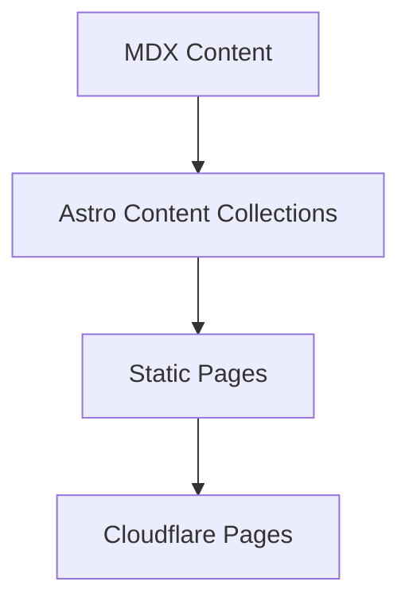

## One-line Summary

A lightweight personal site for project experiments, engineering notes, and technical retrospectives.

## Background

The site needs to avoid self-hosted servers, work with a custom domain, support Markdown/MDX, images, diagrams, and frontend demos.

## Goals

- Ship a presentable first version.
- Keep the content model ready for deeper notes later.
- Deploy through GitHub and Cloudflare Pages.

## Technical Approach

Astro generates the static site. MDX stores project reviews and engineering notes. Plain CSS handles the visual system.

## Architecture Diagram

Mermaid is reserved here. If Mermaid rendering is added later, this block can become a live diagram.

## Difficulties and Tradeoffs

The first version intentionally skips backend services, auth, comments, and databases to keep deployment and maintenance simple.

## Final Result

The skeleton includes home, project list, project detail, post list, post detail, lab, and about pages.

## Retrospective

Start with a clean publishing surface, then expand into search, tagging, automation, and durable knowledge workflows.
